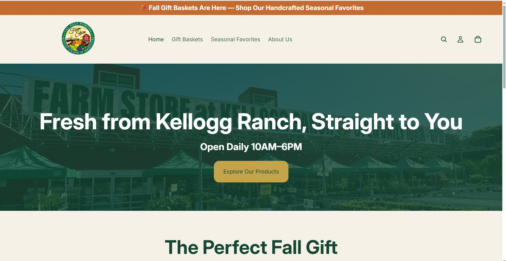
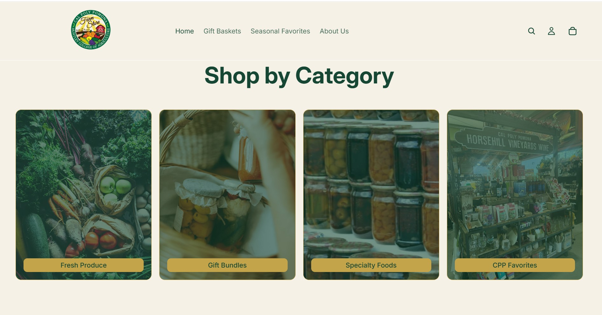
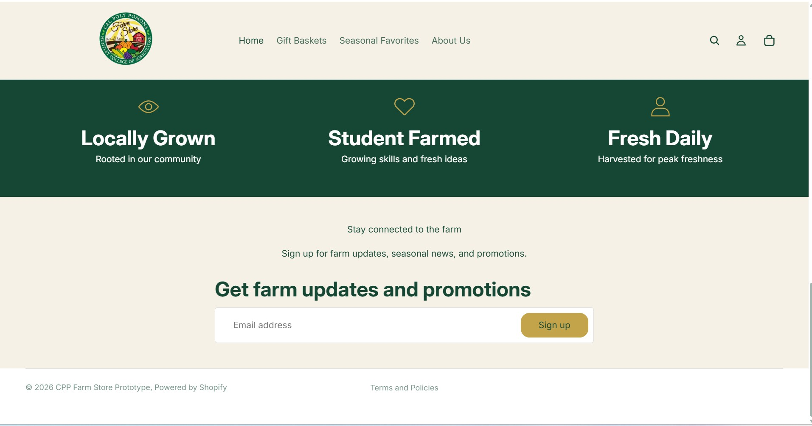
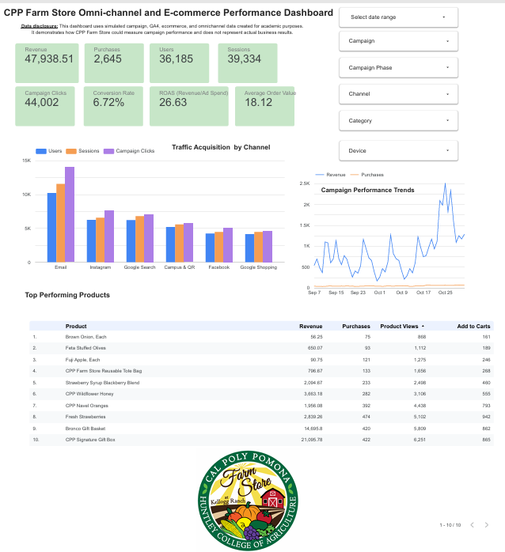

# 1. Executive Summary

The Cal Poly Pomona (CPP) Farm Store is a unique campus operated retailer that provides fresh, locally grown products while supporting the university's agricultural programs and Learn by Doing philosophy. Although the Farm Store offers high quality products and a distinctive shopping experience, its current customer journey contains several opportunities for improvement. Customers face fragmented digital touchpoints, limited online shopping capabilities, and a largely manual gift basket ordering process that creates friction for both customers and employees. These challenges reduce convenience, limit product discoverability, and make it difficult to deliver the seamless omnichannel experience today's consumers expect.

To address these challenges, our team developed an omnichannel retail strategy that connects the Farm Store's physical and digital experiences into one cohesive customer journey. Our recommendations include developing a Shopify storefront to improve online browsing and purchasing, modernizing the gift basket ordering process, optimizing product feeds for online discovery, implementing integrated marketing campaigns across digital channels, and establishing an analytics dashboard to measure customer engagement and business performance. Rather than replacing the Farm Store's existing strengths, these recommendations enhance its current operations while preserving its identity as a locally sourced, university operated retailer.

Our recommendations are supported by customer research, competitive analysis, SWOT analysis, and journey mapping, all of which identified opportunities to improve convenience, visibility, communication, and long term customer engagement. By creating a more connected omnichannel ecosystem, the CPP Farm Store can simplify the customer experience, increase operational efficiency, strengthen customer loyalty, and position itself for sustainable future growth while continuing to serve both the university and surrounding community.

# 2. Client and Situation Analysis

2.1 Company Overview

CPP Farm Store is a university-operated retail store located at Kellogg Ranch on the California State Polytechnic University, Pomona campus. Since opening in 2001, the store has provided students, faculty, staff, and the surrounding community with access to fresh, campus-grown, and locally sourced products. Its product assortment includes campus-grown and locally sourced produce, dairy products, baked goods, grocery items, and a variety of gift products, including customizable gift boxes and baskets, many of which are produced directly through the university's agricultural programs. This close connection to the university differentiates the Farm Store from traditional grocery retailers and reinforces its commitment to quality, sustainability, and local agriculture.

While the Farm Store has built a strong reputation for offering high-quality local products, it operates in an increasingly competitive retail environment where customers expect convenient and integrated shopping experiences. Although the physical store provides a unique in-person experience, its digital capabilities remain limited, particularly in areas such as online product discovery, omnichannel integration, and the gift basket ordering process. Addressing these limitations presents an opportunity to improve both the customer experience and operational efficiency.

To better understand these opportunities, this report evaluates the Farm Store's current business situation by examining its target customers, product offerings, competitive environment, and operational capabilities. This analysis serves as the foundation for the omnichannel recommendations presented in the following sections.

2.2 Target Customers

Understanding the Farm Store's target customers is essential for developing an effective omnichannel strategy. Although CPP Farm Store serves a diverse customer base, each customer segment has different shopping behaviors, preferences, and expectations. Recognizing these differences allows the Farm Store to better align its products, services, and marketing efforts with customer needs while creating a more personalized shopping experience.

The Farm Store primarily serves four customer segments: Cal Poly Pomona students, faculty and staff, local community residents, and campus visitors, including parents and alumni. Students typically look for convenient, affordable, and healthy food options that fit their daily campus routines. Faculty and staff value product quality, convenience, and quick access to fresh products during the workday. Local residents are attracted by the Farm Store's locally sourced and seasonal offerings, while alumni and campus visitors often purchase specialty food products, souvenirs, and gift baskets during campus visits or special events. Each segment contributes to the Farm Store's success by supporting its mission of providing fresh, locally produced products to both the university and the surrounding community.

Among these groups, Cal Poly Pomona students represent the Farm Store's primary target market. As the largest and most accessible customer segment, students frequently visit campus and are highly engaged with social media and mobile devices. Their familiarity with digital channels makes them an important audience for omnichannel initiatives, including online ordering, digital marketing, and mobile-friendly shopping experiences. Successfully engaging this segment can increase customer awareness, encourage repeat purchases, and strengthen long-term brand loyalty.

While students remain the primary focus of the Farm Store's growth strategy, the business should continue serving its broader customer base through an integrated shopping experience that connects online and in-store channels. By addressing the unique needs of each customer segment, the Farm Store can strengthen customer relationships, expand its market reach, and create a more consistent omnichannel experience.

**Table 2.1. Target Customer Segments**

| Customer Segment | Characteristics | Primary Needs |
|------------------------|------------------------|------------------------|
| **CPP Students (Primary Target)** | Ages 18–25, digitally engaged, campus-based | Convenience, affordability, healthy options, easy product information, online ordering |
| **Faculty & Staff** | Campus employees and potential repeat customers | Convenience, quality, fresh products |
| **Local Community** | Families and individuals near CPP | Locally sourced, seasonal, and sustainable products |
| **Alumni & Campus Visitors** | Parents, prospective students, alumni, and event visitors | Gifts, specialty items, locally produced food products |

2.3 Product Categories

CPP Farm Store offers a mix of campus-grown produce and products from outside suppliers. Based on the current product selection, the main categories include CPP Produce, Produce, Bakery, Grocery/Dairy, and Gift Shop products. This variety allows the store to serve customers looking for fresh produce and everyday grocery items, while also offering products that are more closely connected to Cal Poly Pomona.

One of the Farm Store's most distinctive categories is CPP Produce. Current offerings include Cal Poly Pomona-grown oranges, mandarins, lemons, corn, cucumbers, collard greens, and golden melon. The store also sells other produce, including Fuji, Gala, Granny Smith, and Red Delicious apples, as well as potatoes and yams. An important consideration is that the availability of these products can change throughout the season. The current ordering information specifically notes that inventory may fluctuate and that certain items are not guaranteed to be in stock. From an ecommerce perspective, this makes accurate product and inventory information especially important.

The Farm Store also carries products from outside suppliers. The Bakery section includes Old Town products such as bread, cookies, muffins, and Morning Delights. The Grocery/Dairy section currently includes Rosa Brothers products such as whole milk, chocolate milk, and strawberry milk. These categories help expand the Farm Store's selection beyond produce and give customers additional reasons to shop at the store.

The Gift Shop is another important part of the product mix, especially because gift ordering has been a major focus of this project. Available options include the Satsuma Gift Pack, Avocado Mandarin Gift Pack, Custom Gift Basket, and Custom Gift Box. The custom options allow customers to select products from the Farm Store and create a more personalized gift. However, the ordering process has traditionally required customers to contact the store or coordinate directly with employees. This creates an opportunity to simplify the process by providing clearer product information and more convenient digital ordering options.

Overall, the Farm Store has a diverse product mix that combines fresh produce, grocery and bakery items, and customizable gifts. However, seasonal inventory changes and the more personalized nature of gift orders create challenges that should be considered when expanding ecommerce. An effective online experience should make it easy for customers to understand what products are available, view relevant product information, and complete an order with as few additional steps as possible.

**Table 2.2. Main Product Categories**

| Product Category | Examples | Key Consideration |
|------------------------|------------------------|------------------------|
| **CPP Produce** | Oranges, mandarins, lemons, corn, cucumbers, collard greens, golden melon | Availability may change depending on inventory and season |
| **Produce** | Apples, potatoes, yams | Current availability should be clearly communicated online |
| **Bakery – Old Town** | Bread, cookies, muffins, Morning Delights | Some products require customers to specify flavor preferences |
| **Grocery / Dairy** | Whole milk, chocolate milk, strawberry milk | Product information should clearly explain bottle deposits when applicable |
| **Gift Shop** | Gift packs, Custom Gift Baskets, Custom Gift Boxes | Customization and ordering could be made easier through digital channels |

2.4 Current Strengths

CPP Farm Store has several strengths that give it a unique position compared with traditional grocery retailers. One of its main advantages is its strong connection to Cal Poly Pomona. The Farm Store's campus identity and CPP-branded products provide a level of authenticity that is difficult for larger grocery chains to replicate. This connection also allows the store to appeal to students, faculty, staff, alumni, and members of the surrounding community who value supporting the university and locally produced products.

Another important strength is the Farm Store's emphasis on fresh and locally grown products. A large portion of its produce comes directly from the university's agricultural operations, which helps distinguish the store from competitors that rely primarily on conventional supply chains. In addition, the combination of CPP-grown products and items from outside vendors allows the Farm Store to offer a broader selection while maintaining its local identity.

The physical store itself is also an important part of the customer experience. Previous observations identified features such as seasonal displays, CPP private-label merchandising, two store entrances, and the fresh orange juice press as elements that make the location more memorable than a typical grocery shopping trip. Its location on campus also provides access to regular traffic from students, faculty, staff, and campus visitors.

The Farm Store also has an existing digital audience that can support future omnichannel efforts. The team's previous analysis found that its social media accounts already have an established following, which gives the store a starting point for promoting products, seasonal offerings, and online ordering options. Rather than having to build digital awareness entirely from the beginning, the Farm Store can use its existing audience to direct more customers toward improved online shopping options.

Finally, customer service is another strength. Employees are knowledgeable about the products and are willing to assist customers with custom orders, including gift baskets. This personal service is valuable because customization is one of the features that makes the Farm Store different from larger retailers. As digital ordering options are introduced, maintaining this level of personalization will be important to preserve the character of the existing customer experience.

**Table 2.3. Key Current Strengths**

| Strength | Why It Matters |
|------------------------------------|------------------------------------|
| **Connection to Cal Poly Pomona** | Creates a recognizable identity and differentiates the Farm Store from traditional grocery retailers |
| **Fresh and locally grown products** | Provides customers with products closely connected to CPP's agricultural operations |
| **Unique in-store experience** | Seasonal merchandising, CPP branding, and features such as the orange juice press make the physical store distinctive |
| **Campus location** | Provides access to students, faculty, staff, and campus visitors |
| **Existing digital audience** | Gives the Farm Store an established audience for future digital and ecommerce promotion |
| **Personalized customer service** | Supports custom orders and creates a more personal shopping experience |

2.5 Current Weaknesses

Despite its strong connection to Cal Poly Pomona and its unique product offering, the Farm Store currently faces several limitations that affect both the customer experience and its ability to expand across digital channels. Many of these weaknesses are related to the gap between the store's physical experience and its online presence.

One of the main weaknesses is the Farm Store's limited ecommerce functionality. The physical store provides customers with access to a wide range of products, but the online experience does not provide the same level of product discovery and convenience. The team's previous analysis found that customers do not have access to a complete online product catalog or real-time inventory information. This can make it difficult for customers to know what is available before visiting the store, particularly because the availability of fresh and seasonal products can change frequently.

The Farm Store's digital presence is also fragmented across multiple channels. Previous research identified a university webpage, a separate gift website, a food-ordering platform, and multiple social media accounts rather than one central digital destination. While these channels provide some online visibility, having information spread across different platforms can make the customer journey less consistent and may create confusion about where customers should go to browse products, place orders, or find current information.

Another important weakness is the gift basket ordering process. The current process relies heavily on manual communication between customers and Farm Store employees. Customers may need assistance to understand the available options, customize their basket, and complete an order. From an operational perspective, this also creates additional work for employees, especially because the store does not have a dedicated gift basket attendant. Simplifying this process through a more structured digital ordering system could reduce unnecessary steps for both customers and staff.

Marketing and customer communication are also areas for improvement. The Farm Store has an existing social media audience, but the team's earlier analysis found limited use of paid media, email campaigns, and coordinated promotional activities. In addition, there was no evidence of a structured customer relationship management (CRM) process for customer segmentation, post-purchase communication, or channel attribution. These limitations make it more difficult to understand customer behavior and develop targeted marketing efforts.

Finally, the Farm Store's limited operating hours and dependence on the physical location can reduce accessibility for customers who cannot visit during store hours. Without a fully integrated online shopping option, these customers have fewer opportunities to browse products or interact with the store outside of a physical visit. This reinforces the need for digital channels that complement the in-store experience rather than replace it.

**Table 2.4. Key Current Weaknesses**

| Weakness | Potential Impact |
|------------------------------------|------------------------------------|
| **Limited ecommerce functionality** | Customers have fewer opportunities to browse and purchase products online |
| **No complete online catalog or real-time inventory** | Customers may not know what products are available before visiting |
| **Fragmented digital presence** | Customers must navigate multiple platforms to find information |
| **Manual gift basket ordering process** | Creates additional steps for customers and employees |
| **Limited coordinated digital marketing** | Reduces the Farm Store's ability to consistently promote products and offers |
| **Limited CRM capabilities** | Makes customer segmentation, follow-up communication, and attribution more difficult |
| **Dependence on physical store hours** | Limits access for customers who cannot visit during operating hours |

2.6 Market and Environmental Opportunities

CPP Farm Store has several opportunities to improve its market reach and respond to changes in customer shopping behavior. One of the most important is the continued shift toward digital and omnichannel shopping. Customers increasingly expect to be able to find product information online before deciding when and where to make a purchase. For the Farm Store, improving the connection between its digital channels and physical location could make the shopping process more convenient without taking away from the in-store experience.

A stronger digital presence also creates an opportunity to increase awareness among Cal Poly Pomona students, the primary target market identified in the team's previous analysis. Although the Farm Store is located on campus, the team found that awareness remains relatively low among many students. Because this customer segment is highly engaged with social media and mobile devices, digital communication can help the Farm Store reach students who may not currently consider it part of their regular shopping routine.

The Farm Store can also benefit from its connection to the broader Cal Poly Pomona community. Partnerships with student organizations, campus events, and university activities could create additional opportunities to introduce customers to the store and its products. Graduation, holidays, and other campus events may be especially relevant for promoting gift products and seasonal offerings. The Farm Store's connection to CPP gives it access to a community that traditional grocery competitors cannot easily replicate.

Another opportunity involves developing stronger relationships with existing customers. The team's previous situation analysis identified loyalty and rewards programs as a potential area for growth. Combined with better customer data and communication, this could allow the Farm Store to encourage repeat visits and provide more relevant promotions to different customer groups.

Finally, the Farm Store's gift products offer an opportunity for digital growth. Gift packs, Custom Gift Baskets, and Custom Gift Boxes provide customers with options that go beyond traditional grocery purchases. Making these products easier to discover and order online could expand their reach beyond customers who already know about the service or visit the physical store. This is particularly relevant because improving the gift ordering process has been identified as one of the main business priorities for the project.

**Table 2.5. Key Market Opportunities**

| Opportunity | Potential Value for CPP Farm Store |
|------------------------------------|------------------------------------|
| **Omnichannel shopping** | Connect online product discovery and ordering with the physical store experience |
| **Greater student awareness** | Reach more of the Farm Store's primary target market |
| **Digital and social media marketing** | Increase visibility of products, seasonal offerings, and promotions |
| **Campus partnerships and events** | Use CPP's existing community to attract new and returning customers |
| **Loyalty and rewards** | Encourage repeat purchases and strengthen customer relationships |
| **Digital gift ordering** | Make gift products easier to discover, customize, and order |

2.7 Competitive and Operational Challenges

CPP Farm Store operates in a competitive retail environment where customers have several alternatives for purchasing fresh produce, groceries, and specialty products. The team's previous industry analysis identified high competitive rivalry and high buyer power as important challenges. Customers can easily compare prices and choose among different retailers, making product quality, convenience, and differentiation important factors in the Farm Store's ability to compete.

Grocery retailers such as Trader Joe's, Whole Foods, and Sprouts represent important competitors because customers can compare price, product selection, and convenience across different shopping alternatives. Rather than competing directly with larger retailers based on size or product variety, the Farm Store has an opportunity to differentiate itself through its connection to Cal Poly Pomona, campus-grown products, and unique specialty offerings. These characteristics give the Farm Store an identity that is difficult for traditional grocery retailers to replicate.

The Farm Store also faces challenges related to seasonal and fluctuating inventory. Fresh and locally grown products are an important part of its product assortment, but availability can change depending on season and supply. The current product information reviewed for this project states that some items are not guaranteed and that inventory may fluctuate. This presents an additional challenge for ecommerce because online product information needs to reflect availability as accurately as possible. Keeping this information updated can help reduce situations in which customers attempt to order products that are no longer available.

From an operational perspective, staffing and order management are also important considerations. The team's previous analysis found that staffing is relatively limited and that there is no dedicated employee assigned specifically to gift basket orders. As a result, custom gift orders may require employees to divide their attention between regular store responsibilities and assisting customers with the ordering process. If online and custom orders increase in the future, the Farm Store will need to consider how these orders can be managed without creating unnecessary additional work for employees.

Broader economic and market conditions may also affect the Farm Store. The team's SWOT analysis identified rising food costs and inflation, changes in consumer shopping habits, competition from food delivery services, and seasonal fluctuations in customer traffic as potential threats. These factors are largely outside the Farm Store's direct control, but they may influence customer purchasing decisions and increase the importance of offering a convenient and differentiated shopping experience.

Overall, the Farm Store's competitive challenge is not simply competing with larger grocery retailers. It must balance the characteristics that make it unique—including locally grown products, seasonal availability, personalized service, and its connection to Cal Poly Pomona—with changing customer expectations and its own operational limitations. As the Farm Store expands its digital capabilities, it will be important to maintain these strengths while ensuring that new ecommerce processes are realistic given its inventory and staffing resources.

**Table 2.6. Competitive and Operational Challenges**

| Challenge | Potential Impact |
|------------------------------------|------------------------------------|
| **High retail competition** | Customers have many alternatives for groceries and fresh products |
| **High buyer power** | Customers can easily compare price, selection, and convenience |
| **Seasonal and fluctuating inventory** | Online product availability may be difficult to keep consistently updated |
| **Limited staffing** | Additional digital and custom orders could increase employee workload |
| **Rising costs and inflation** | May affect operating costs and customer purchasing decisions |
| **Changing shopping behavior** | May increase the importance of convenient and accessible shopping options |
| **Food delivery competition** | Alternative services compete with the Farm Store for customer spending and convenience |
| **Seasonal customer traffic** | Demand may vary throughout the year and by season |

2.8 SWOT Summary

The SWOT analysis summarizes the main internal and external factors affecting CPP Farm Store's current retail position. The Farm Store benefits from its strong connection to Cal Poly Pomona, locally grown products, distinctive in-store experience, and established relationship with the campus community. At the same time, limited ecommerce capabilities, fragmented digital channels, and operational constraints make it more difficult to provide a consistent shopping experience across physical and digital channels.

These challenges also create opportunities for growth. Improving digital product discovery, strengthening customer communication, and connecting online ordering with the physical store could make the Farm Store more accessible to its existing customers while helping increase awareness among students. However, the Farm Store must also consider external challenges such as retail competition, rising food costs, changing consumer behavior, food delivery alternatives, and seasonal fluctuations in customer traffic.

**Table 2.7. SWOT Analysis**

| Strengths | Weaknesses | Opportunities | Threats |
|------------------|------------------|------------------|------------------|
| Strong connection to Cal Poly Pomona | Limited ecommerce functionality | Improve the omnichannel shopping experience | Competition from grocery retailers |
| Fresh, locally and campus-grown products | Fragmented digital presence | Expand digital and social media marketing | Rising food costs and inflation |
| Unique specialty products | Manual gift basket ordering process | Improve online product discovery and ordering | Changes in consumer shopping habits |
| Distinctive in-store experience | Limited coordinated marketing | Develop loyalty and rewards initiatives | Competition from food delivery services |
| Convenient campus location | Limited CRM and customer tracking capabilities | Partner with student organizations and campus events | Seasonal fluctuations in customer traffic |
| Existing social media audience | Limited operating hours and staffing | Improve the digital gift ordering experience | Fluctuating product availability |

Overall, the situation analysis shows that CPP Farm Store is well positioned to strengthen its omnichannel strategy by building on its connection to Cal Poly Pomona, distinctive product assortment, and existing customer base. However, gaps between the store's physical and digital channels currently limit the convenience and accessibility of the customer experience. Addressing these gaps can help the Farm Store better connect with customers while preserving the qualities that make it unique. The following customer journey analysis examines these challenges in greater detail and identifies key areas where the customer experience can be improved.

# Omnichannel Journey Analysis

## Omnichannel Journey Analysis

Developing an omnichannel strategy begins with understanding how customers interact with a business across every stage of their shopping experience. To identify opportunities for improvement, our team created a customer journey map that illustrates how customers discover, evaluate, purchase, receive, and continue engaging with the CPP Farm Store. Mapping these interactions allowed us to identify pain points throughout the customer experience and develop recommendations that create a more seamless connection between the Farm Store's physical location, digital channels, and future ecommerce platform.

### Target Customer Segment

The primary target customer for the CPP Farm Store is Cal Poly Pomona students. As the largest and most accessible customer segment, students regularly engage with university communications, social media, and mobile technology, making them the ideal audience for an integrated omnichannel strategy. In addition to students, the Farm Store also serves faculty and staff, local community members, alumni, parents, and campus visitors who value locally grown products, sustainable agriculture, and supporting the university. Each of these customer groups shares a common expectation: a shopping experience that is convenient, informative, and accessible across multiple channels.

## Customer Journey

### 1. Awareness

The customer journey begins when potential customers first become aware of the Farm Store through social media, campus events, word of mouth recommendations, university marketing, or in-store signage. During this stage, customers are primarily seeking information about what the Farm Store offers, whether it is open to the public, and why it differs from traditional grocery retailers. Building awareness is essential because many potential customers remain unfamiliar with the Farm Store's locally sourced products and specialty offerings.

### 2. Consideration

Once awareness has been established, customers begin evaluating whether the Farm Store meets their needs. They browse product categories, compare prices, explore gift basket options, and search for information regarding store hours, product availability, and ordering procedures. This stage revealed one of the project's largest opportunities for improvement. Customers currently navigate multiple digital resources to find information, creating unnecessary confusion before making a purchase decision.

### 3. Purchase

During the purchase stage, customers complete their transaction either in-store or through an online ordering platform. Customers expect a simple checkout process, secure payment options, clear pricing, and confidence that products will be available when they arrive. Our analysis found that the existing manual gift basket ordering process introduces unnecessary complexity for both customers and employees, increasing the time required to complete purchases.

### 4. Fulfillment

After placing an order, customers expect timely communication and a convenient fulfillment experience. Whether products are picked up in-store or delivered, customers benefit from automated order confirmations, clear pickup instructions, and regular status updates. Improving this stage not only increases customer satisfaction but also reduces operational inefficiencies associated with manual communication.

### 5. Post Purchase

The customer experience continues after the sale has been completed. Following delivery or pickup, customers evaluate product quality, customer service, and the overall purchasing experience. Follow-up communication, customer support, and opportunities for future engagement play an important role in shaping customer satisfaction and encouraging repeat purchases.

### 6. Loyalty

The final stage focuses on developing long term customer relationships. Satisfied customers are more likely to return for seasonal products, recommend the Farm Store to others, and engage with future promotions through email marketing and social media. Strengthening customer loyalty ultimately increases lifetime customer value while supporting continued growth for the Farm Store.

## Key Customer Touchpoints

Throughout the customer journey, customers interact with numerous physical and digital touchpoints that influence their overall experience. Digital touchpoints include Instagram, Facebook, the CPP website, the proposed Shopify storefront, product pages, email communications, and online checkout. Physical touchpoints include campus events, in-store signage, point of sale systems, customer service interactions, and in-store pickup. Collectively, these touchpoints provide multiple opportunities to educate customers, simplify purchasing decisions, and reinforce the Farm Store's brand.

## Pain Points and Omnichannel Opportunities

Journey mapping revealed several areas where the current customer experience can be strengthened. Customers often encounter fragmented information across multiple digital platforms, making it difficult to locate product information, understand the gift basket ordering process, or determine available purchasing options. Manual ordering procedures increase employee workload while creating unnecessary friction during the purchasing and fulfillment stages. In addition, limited post purchase communication reduces opportunities to strengthen customer relationships and encourage repeat visits.

These findings informed several key opportunities for improvement. Implementing a centralized Shopify storefront creates a single destination for browsing products, placing gift basket orders, and completing purchases. Integrating online ordering with secure payment processing and in-store pickup simplifies the purchasing process while reducing manual administrative work. Enhanced product feeds improve online discoverability, coordinated digital marketing campaigns strengthen awareness across multiple channels, and an analytics dashboard enables the Farm Store to continuously evaluate customer behavior and campaign performance. Together, these improvements create a more consistent omnichannel experience while preserving the Farm Store's unique identity and community focused mission.

## How the Journey Map Informed Our Recommendations

The customer journey map served as the strategic foundation for every recommendation presented throughout this report. Each proposed solution directly addresses a pain point identified within one or more stages of the customer journey. The Shopify prototype improves product discovery and simplifies the consideration and purchase stages. The retail media strategy increases awareness by expanding digital visibility across search and social channels. The campaign plan strengthens engagement before and after the purchase, while the analytics dashboard provides measurable insights that support continuous optimization. Rather than functioning as independent recommendations, each component contributes to a unified omnichannel strategy designed to create a seamless customer experience from initial discovery through long-term customer loyalty.

# Ecommerce / Shopify Prototype

Link: <https://cpp-farm-store-prototype.myshopify.com/>

## **CPP Farm Store — Shopify Mini-Store Recommendation**

### Purpose

This store was built to show how a farm , specifically a campus farm like CPP's can have a real, professional online presence without overcomplicating things an making the UX experience very simple. The goal was to prove that a small, mission-driven retailer can use Shopify to serve both online customers and people who walk up to a physical stand, all from one platform.

### Product Categories

The five collections weren't chosen randomly. **Fresh Produce** and **Specialty Foods** represent the farm's core inventory and what they grow and make. **Gift Bundles** taps into a high-value buying occasion, since people often want to give local, artisanal products as gifts. **Seasonal Favorites** reflects the reality of farm retail which is that not everything is available year-round, and highlighting what's in season creates urgency and authenticity. **CPP Favorites** acts as a curated "start here" for new visitors who don't know where to start.

### Homepage Strategy

The homepage prioritizes gifts and seasonal items because those are the products most likely to convert a first-time visitor. Someone landing on the site for the first time doesn't need to see everything — they need to see something compelling quickly. Leading with Gift Baskets and Seasonal Favorites does exactly that.

### Product Page Strategy

By organizing products into meaningful collections, each product page carries context. A customer looking at a jar of honey in **Specialty Foods** understands it's an artisanal, value-added product — not just a commodity. That framing influences how people perceive value and makes them more likely to buy.

### Navigation Structure

The menu: **Home → Gift Baskets → Seasonal Favorites → About Us** tells a story. It moves the customer from arrival, to the most giftable product, to what's fresh right now, to who we are. The About Us placement at the end is intentional: once someone is interested, they want to know the story behind the farm before committing to a purchase. There is also very important information about the farm store located in the **About Us page.**

### Customer Experience

The supporting pages: Store Pickup, Store Info, Contact, About Us, and Privacy were each added with a specific customer in mind. A local student might want to pick up an order between classes. A parent visiting campus might want to know the store's hours. A first-time online buyer might want to read the farm's story before trusting them with a purchase. Each page answers a real question a real customer would have.

### Online & Offline Shopping

Most small farm stores are either fully in-person or fully online so this prototype bridges both. With the CPP Farm Store's shopify website, online shoppers get a full e-commerce experience with collections, product pages, and checkout. In person shoppers are supported through the Store Pickup and Store Info pages, which reduce friction for locals who prefer to visit in person but want to browse or order ahead online. The two channels reinforce each other rather than competing.

# Product Feed / Retail Media Setup

## 5. Product Feed and Retail Media Setup

A strong product feed would allow CPP Farm Store to make selected products easier to discover through Google Search, Google Shopping, and future retail media campaigns. Rather than placing every Farm Store product online immediately, CPP Farm Store should begin with a smaller group of products that are easy to maintain, visually appealing, and well suited for online discovery and in-store pickup.

### Selected Products

The initial product feed should focus on categories with strong customer appeal and manageable inventory. Recommended categories include:

- Seasonal produce bundles

- Gift baskets and gift bundles

- Plants and seasonal nursery products

- CPP-branded merchandise and campus gifts

- Shelf-stable specialty products such as honey, jams, nuts, and sauces

These products provide a mix of everyday purchases, seasonal products, and gift-oriented items that can appeal to students, faculty, staff, alumni, and members of the surrounding community.

### Feed Structure

Each product listed online should contain complete and consistent information across Shopify, the CPP Farm Store website, and Google Merchant Center. Important feed attributes include the product title, description, price, availability, product image, landing-page URL, product category, and relevant product identifiers when available.

Shopify can serve as the central ecommerce platform where product information is maintained. Product information can then be submitted to Google Merchant Center so eligible products can appear across Google surfaces. Keeping Shopify and Merchant Center information synchronized is especially important because customers should see the same price and availability information when moving from Google to the Farm Store website.

### Product Titles and Descriptions

Product titles should be specific, searchable, and easy for customers to understand. Instead of using general titles such as “Gift Basket” or “Fruit Box,” the Farm Store should use descriptive titles such as “CPP Farm Store Seasonal Fruit Basket” or “Cal Poly Pomona Local Produce Box.”

Descriptions should identify what the product contains, its major benefits, approximate size or quantity when relevant, seasonal availability, and pickup information. Product descriptions should also naturally include terms customers may use while searching without becoming overly promotional.

Consistent naming is especially important because unclear or incomplete product information can reduce visibility in Google Shopping and create confusion for customers.

### Product Image Needs

High-quality product photography should be a major priority. Each product should have a clear primary image with good lighting and minimal background distractions. Additional images can show product size, packaging, individual items included in a bundle, or the product in use.

Gift baskets, produce bundles, plants, and CPP-branded merchandise are particularly strong opportunities for visual merchandising. Consistent photography would make the Farm Store appear more professional across Shopify, Google Shopping, social media, and campaign materials.

### Product Categories

Products should be organized into clear categories that match how customers shop. Recommended categories include:

- Fresh Produce

- Seasonal Bundles

- Gift Baskets

- Plants and Nursery

- CPP Merchandise

- Specialty Foods

Using consistent categories would improve both website navigation and product-feed organization while making it easier to analyze performance by product type.

### Feed-Quality Concerns

One of the biggest challenges for CPP Farm Store is the seasonal and changing nature of its inventory. Produce, plants, and seasonal items may become unavailable quickly, creating the risk that Google displays a product that is no longer available in the store.

Other potential feed-quality issues include inconsistent product naming, outdated prices, low-quality or missing images, incomplete product descriptions, missing product identifiers, and unclear pickup instructions. Price and availability information should match between Shopify, Google Merchant Center, and the physical store.

Because CPP Farm Store operates differently from a traditional ecommerce retailer, staff time is another important consideration. The Farm Store should create a simple process for reviewing inventory, updating seasonal products, and checking Merchant Center for product warnings or disapprovals.

### Recommended Products for Promotion

CPP Farm Store should initially promote products that have broad appeal, strong visual presentation, and relatively predictable availability. Seasonal produce bundles and gift baskets are especially strong candidates because they combine multiple Farm Store products into convenient purchases while also increasing average order value.

Promotional themes could include fresh fruit packs, finals-week snack bundles, alumni gifts, holiday gift boxes, and seasonal produce bundles. The Farm Store could also cross-merchandise produce with shelf-stable products such as honey, jams, nuts, and sauces.

Retail media should initially support online discovery rather than attempt to turn CPP Farm Store into a fully online retailer. Google Search and Shopping can introduce customers to available products, while Shopify provides product information and the physical Farm Store or pickup experience completes the purchase journey.

Overall, CPP Farm Store should begin with a limited, high-quality product feed and expand only after its inventory management and pickup processes are reliable. This approach would improve online product discovery while remaining realistic for the Farm Store's seasonal inventory and available resources.

# Campaign Plan

# Creative Brief / AI Assets

# Analytics Dashboard

- **Measurement objectives**

  The goal of the dashboard that we created was to show the information the CPP Farm Store could track if they had their marketing, website, and sales data set up and integrated. Because the Farm Store does not have any of this data currently available, we created simulated data to demonstrate what a future CPP Farm Store dashboard could look like.

- **Data sources**

  Since the CPP Farm Store does not have the data available, our dashboard uses a simulated campaign, GA4, eccomerce, and omnichannel data for academic purposes. The numbers that are found in the data spreadsheet are not real CPP Farm Store results.

  The reason for choosing this tpe of data was because they represent information that the Farm Store could collect in the future. GA4 could provide website information like users and sessions while ecommerce or sales data can provide purchases, revenue, and product performance. Marketing campaign data could provide the Farm Store with information about click and advertising performance. So by combining these sources, the Farm Store could have a better overall picture of how customers and potential customers interact with their store.

- **KPIs**

  The KPI''s we decided to choose would give the Farm Store a simple overview of its performance. So our dashboard includes

  - **Revenue** - money generated from sales

  - **Purchases** - how many purchases customers make

  - **Users** - how many people visit the website

  - **Sessions** - total number of website visits

  - **Campaign Clicks** - how many clicks marketing campaigns receive

  - **Conversion Rate** - how often website visits turn into purchases

  - **ROAS ( Return on Ad Spend)** - tells us whether advertising is generating enough revenue compared to what is being spent.

  - **Average Order Value** - how much customers spend on average per purchase

- **Dashboard screenshots or link**

  {width="702"}

  CPP Farm Store Simulated Data: <https://docs.google.com/spreadsheets/d/1VGpNvBcBvh3cdmXxKpXOL_6eN2AIgGyc39b_xcC3XsE/edit?usp=sharing>

- **Key insights**

- **Recommended actions**

- **Data limitations**

# Final Recommendations

# Conclusion

# Appendix

- [GitHub Repo](https://github.com/lewiswaddell/GP7.git)

- [GitHub Page](https://lewiswaddell.github.io/GP7/)

- [Creative Asset OneDrive](https://livecsupomona-my.sharepoint.com/:f:/g/personal/lewiswaddell_cpp_edu/IgAHNSasOhFFTKvCIr9KSiX4ARCBBBdovH_U_9iEdJw09Hg?e=lHWzJb)

- Presentation Slides
